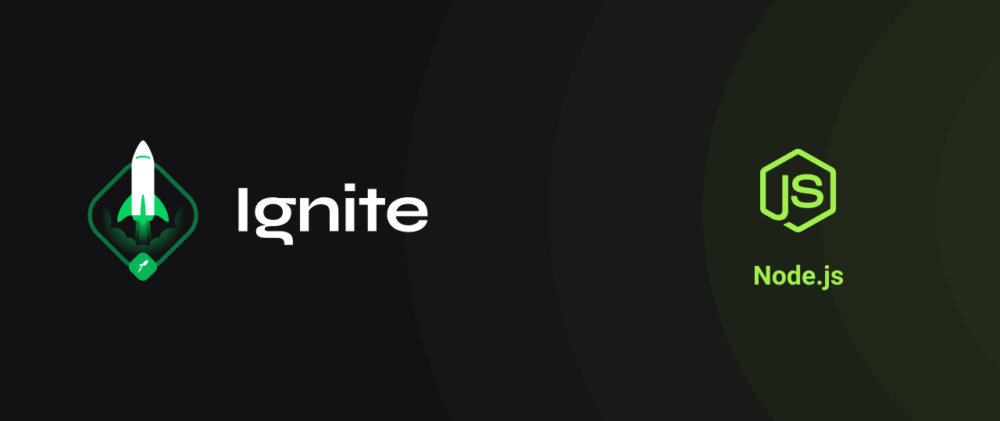

# nodejs-ignite :rocket:

# Summary

This is the repository I used to study and follow the classes of NodeJS on RocketSeat Ignite.

## Chapter 1

### Fundamentos do NodeJS
- [x] Conceitos
- [x] FConfigurando o projeto

### Primeiro Projeto com Node

- [x] Primeiro Projeto com Node

### Desafios

- [x] Desafio: Conceitos do Node.js
- [x] Desafio: Trabalhando com Middlewares
- [x] Desafio: Corrigindo o código

## Chapter 2

### Iniciando a API

- [x] Iniciando a API

### Desafios

- [x] Desafio: Introdução ao SOLID
- [x] Desafio: Documentando com Swagger

## Chapter 3

### Continuando a aplicação

- [x] Conhecendo o Docker
- [x] Trabalhando com banco de Dados
- [x] Injeção de dependência
- [x] Usuário
- [x] Avatar de usuário

### Desafios

- [x] Desafio: Database Queries
- [x] Desafio: Modelagem do banco de dados

## Chapter 4 

### Testes e regra de negócio

- [x] Testes
- [x] Requisitos
- [x] Carros
- [x] Aluguel
- [x] Testes de integração

### Desafios

- [x] Desafio: Testes unitários
- [ ] Desafio: Testes de integração

## Chapter 5

### Trabalhando com refresh_token e email

- [x] Carro
- [x] Autenticação
- [ ] Recuperação de senha
- [ ] Testes

### Desafios

- [ ] Desafio: Transferências com a FinAPI

## Chapter 6

### Deploy

- [ ] Refresh token
- [ ] Configurando AWS
- [ ] Preparando deploy
- [ ] Deploy
- [ ] CI/CD
- [ ] Segurança

### Serverless

- [ ] Serverless
- [ ] Microsserviços

### Desafios

- [ ] Desafio: Construindo com serverless